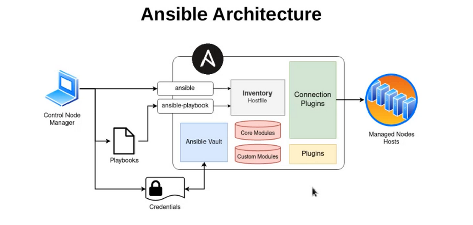

###IAC Approaches


**Impretive**
- Step-by-step configuration
- Classic approach
- Using scripting languages
- Hard to manage


**Declarative**
- Desired state
- Modern Approach
- Using automation tools
- Easy to manage

###IAC Methods
- **Pull method:** Server pulls configuration from the agent.
- **Push method:** Agent pushes configurations to servers.


####Why Ansible:
- Agent less
- Ease of use
- Support both approaches and both methods.


#####Major Ansible command's
```
ansible
```
```
ansible-playbook
```



###Components


- **Control node:** install ansible on this
- **Inventory:** name and information about managed nodes.
- **Core modules:** some modules that the ansible team provides to install.
- **Custom modules:** some modules that some peoples write.
- **Plugins:** some modules that add capabilities to the ansible and control nodes.
- **Ansible vault:** for storing credentials.

######The connection plugin's default is ssh.


